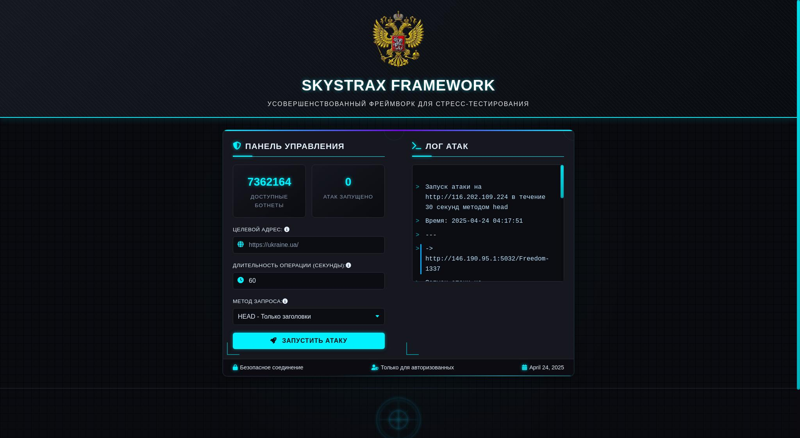

# SkyStrax Framework Remake v3.5



SkyStrax Framework is a simple, elegant, and modern web (DDoS) Framework with a minimalist design thats easy to manage.

## Key Features

- ✅ **Modern Web UI**: Simple, elegant, luxurious, minimalist, and modern appearance
- 🧩 **Modular**: Easy-to-expand modular structure
- 🔧 **Easy Management**: Simple and intuitive management
- ⚡ **Powerful**: High performance with complete features
- 🔓 **Open Source**: Free to modify and develop
- 🚀 **Ready-to-Use**: Quick installation and ready to deploy

## Prerequisites

- Node.js v23.9.0 or newer
- npm v11.3.0 or newer
- PHP 8.4.6 (optional, for specific features)

## Project Structure

```
SkyStrax/
├── api/
│   ├── api.js
│   └── zblyatovsch/
│       ├── get.js
│       ├── head.js
│       ├── post.js
│       └── uagent.txt
├── api.txt
├── index.php
├── package.json
├── package-lock.json
├── sc.js
├── styl.css
├── uagent.txt
└── web.sh
```

## Installation

1. Clone this repository or download the source code
2. Open terminal and navigate to the project folder
3. Run the following command:

## Running the Application

### open web gui

```bash
npm start # make sure u already "n pm install" before it
```

Ensure API is running at `api/api.js` or you already have a list of online APIs in `api.txt`.

### Running the API

To start the API server:

```bash
node api/api.js
```
## Next Update :

add new method : 

Layer 7 :
RANDOM
TLS
HTTPX
ASYNC
SLOWLORIS

Layer 4: 
TCP, SYN, UDP
## Configuration

You can configure various aspects of the framework through:
- `api.txt` for API list
- `styl.css` for custom styling
- `api/zblyatovsch/` for add new methods 

# NOTE : dont sell this script JEBE!
# #AntiMargaStore